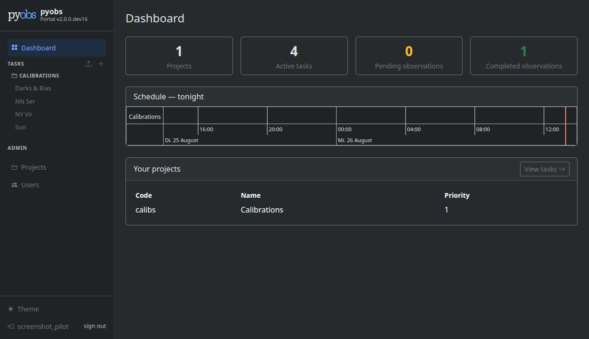
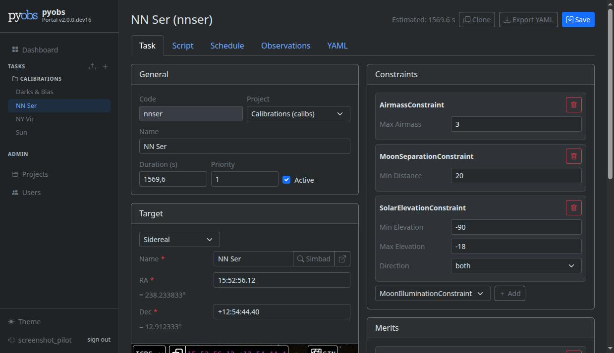
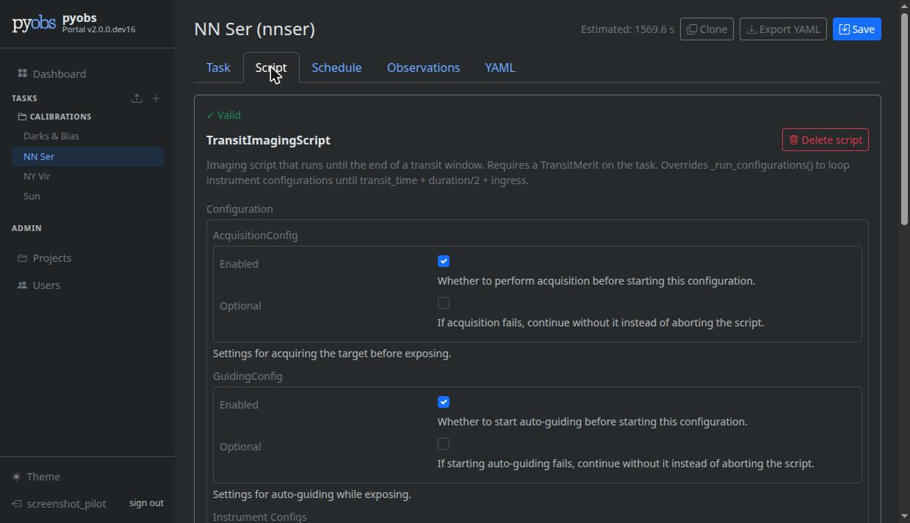
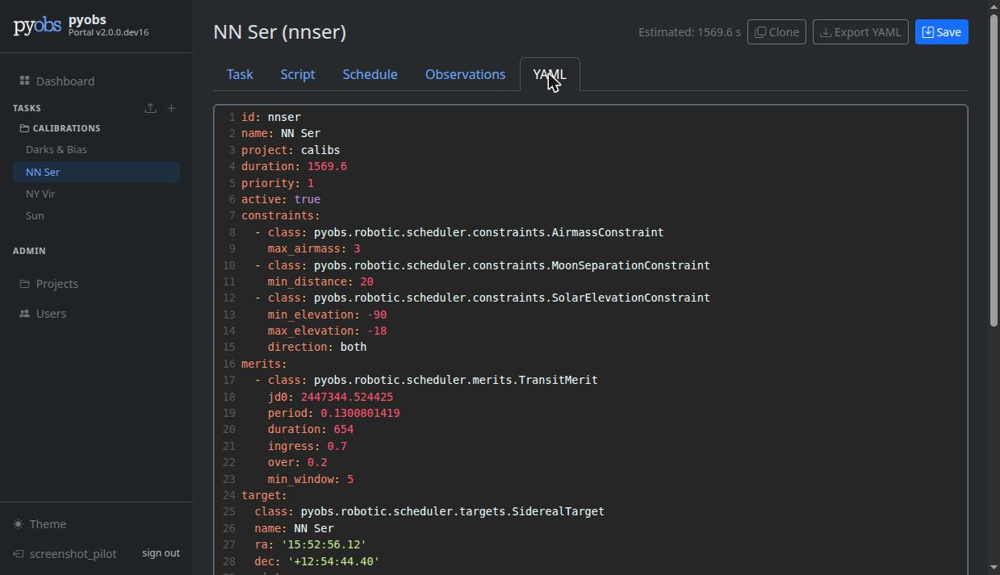

Web Frontend
############

Enabled with ``ENABLE_FRONTEND=1`` (see :doc:`configuration`); the REST API is always available
regardless. The browser UI is mounted at ``/`` and requires a login.

Screenshots
===========

Dashboard, with per-project stats and tonight's schedule:

Task editor, with dynamic schema-driven constraint forms:

         Separation, and Solar Elevation constraints.
   :width: 100%

The script builder, introspecting a script class's fields with live validation:

         sections.
   :width: 100%

The same task as live-validated YAML:

- **Sidebar** — task list grouped by project; click a task to open it. Upload icon imports a task
  from YAML; ``+`` creates a new task.
- **Task overview** — tabular view of all tasks grouped by project with bulk activate/deactivate
  via checkboxes.
- **Task editor** — tabbed view with **Task** (general fields, target, constraints, merits),
  **Script** (a schema-driven script builder — see :doc:`architecture` — with live validation and
  template insertion), **Schedule** (upcoming observations), and **Observations** (completed/
  cancelled history). Each completed/aborted/failed observation links straight to its archived
  data in the archive's own UI, with an on-demand frame count/reduction-status check.

  - **Sidereal target** — RA/Dec fields accept decimal degrees or hms/dms (e.g. ``15:52:56.12`` /
    ``+12:54:44``). A Simbad name-search button resolves object names and populates the
    coordinates. An `Aladin Lite <https://aladin.cds.unistra.fr/AladinLite/>`_ DSS sky view is
    shown below the target form and pans live as coordinates change.
  - **Duration estimation** — stopwatch button calls ``/api/estimate_duration/`` on the current
    script.
  - **Clone** — copies the current task to a new code, opening a pre-filled editor without saving.
  - **Export YAML** — downloads the current form state as a ``.yaml`` file.
  - **Import YAML** — available in the sidebar and task overview; opens a pre-filled editor from a
    ``.yaml`` file without saving.

- **Default constraints/merits** — set ``DEFAULT_CONSTRAINTS``/``DEFAULT_MERITS`` to pre-fill new
  tasks with site-specific defaults.
- **Admin panel** — superusers can manage users (including password changes) and projects at
  ``/admin-panel/``.

All data is fetched client-side from the same ``/api/`` endpoints (see :doc:`api`) that
`pyobs-task-editor <https://github.com/pyobs/pyobs-task-editor>`_ uses.
